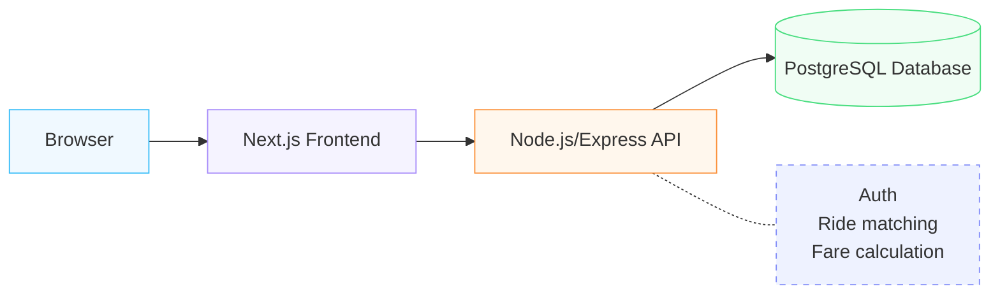
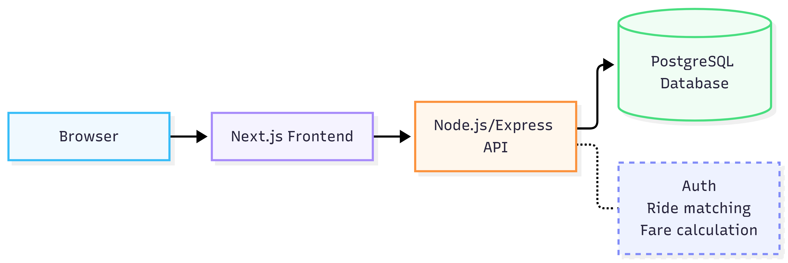

## Pooling rule:
 two ride requests may share a Pool when they have the same pickup zone AND both destination zones appear in the compatible-destinations list configured for that pickup zone.

## New-vehicle rule:
 a vehicle is available to start a brand-new Pool only if it is online AND has no Pool containing a RideRequest whose status is not COMPLETED or CANCELLED.

## Seat release rule:
 cancelling a RideRequest sets its PoolMember.isActive to false; capacity calculations only ever sum isActive = true members, so a cancelled passenger's seat becomes available to a new request immediately.