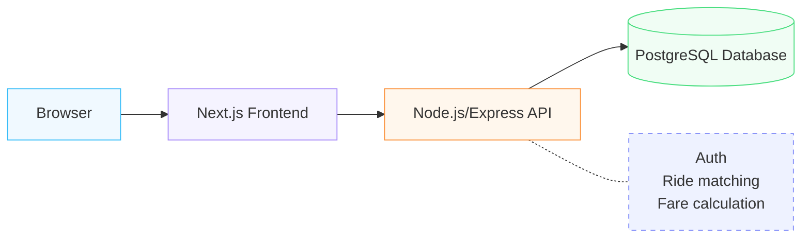

## Pooling rule:
 two ride requests may share a Pool when they have the same pickup zone AND both destination zones appear in the compatible-destinations list configured for that pickup zone.

## New-vehicle rule:
 a vehicle is available to start a brand-new Pool only if it is online AND has no Pool containing a RideRequest whose status is not COMPLETED or CANCELLED.

## Seat release rule:
 cancelling a RideRequest sets its PoolMember.isActive to false; capacity calculations only ever sum isActive = true members, so a cancelled passenger's seat becomes available to a new request immediately.

1. Validate the request (zones exist, pickup ≠ destination, seats ≥ 1).
2. Look for an OPEN Pool where: vehicle.isOnline = true,
   pool.pickupZone = request.pickupZone,
   pool.destinationZone ∈ COMPATIBLE_ROUTES[request.pickupZone],
   sum(members WHERE isActive=true, seatsRequested) + request.seatsRequested ≤ vehicle.capacity.
   (Candidate check only — re-verified under lock in step 3.)
3. If found → transactionally re-check capacity under a row lock (counting only
   isActive=true members) and claim seats. Compute pooled fare. RideRequest → MATCHED.
4. If no eligible pool → look for an online vehicle NOT already mid-trip (no Pool
   of theirs contains a RideRequest whose status isn't COMPLETED/CANCELLED).
5. If found → create a new OPEN Pool for it, claim seats transactionally, solo fare,
   RideRequest → MATCHED.
6. If no vehicle available → leave RideRequest.status = REQUESTED, return
   "no driver currently available right now" (re-matching on a driver coming online
   is a documented Day-4/future enhancement, not built for the MVP).

Cancellation: sets RideRequest.status = CANCELLED AND that RideRequest's
PoolMember.isActive = false, in the same transaction, so the seat is immediately
available to future capacity checks. The Pool and other members are untouched.