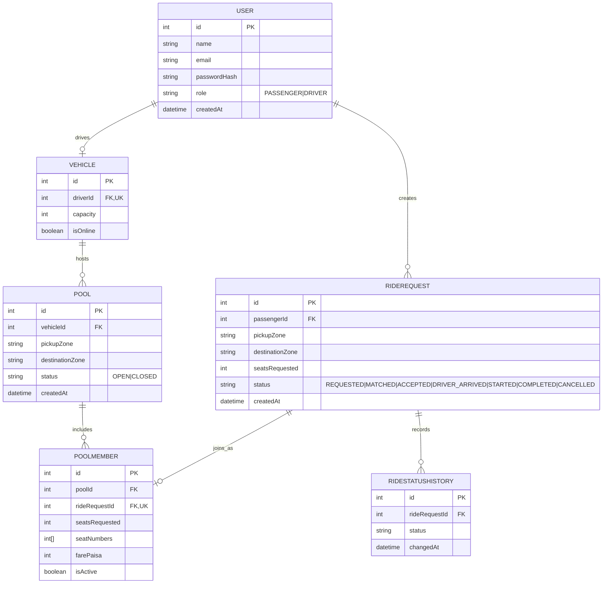
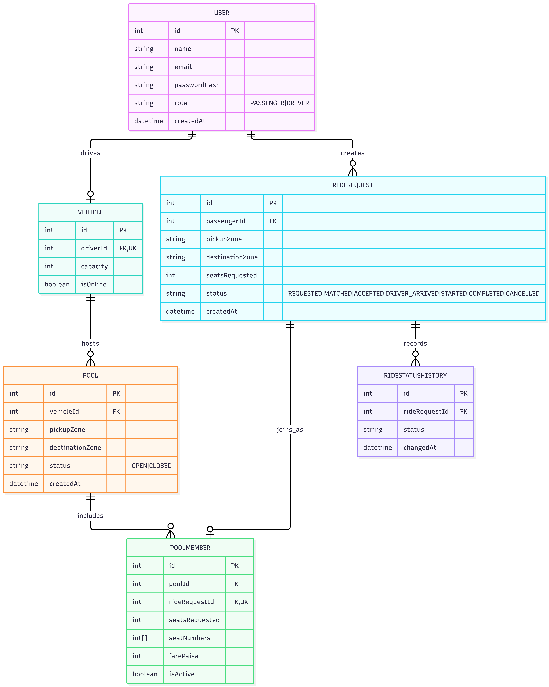

## Why Pool carries its own pickupZone/destinationZone
The matcher needs somewhere to read an existing pool's route from when deciding if a new request can join it. Without this, a Pool would have no way to represent what trip it's actually doing.

## Why Pool and RideRequest are separate
A Pool is the shared vehicle-trip; a RideRequest is one passenger's own journey with its own status. Keeping them separate means one passenger cancelling never affects the Pool or other passengers.

## Why PoolMember has isActive
Cancelling a RideRequest sets its PoolMember.isActive to false instead of deleting the row. This releases the seat for capacity checks (a new passenger can claim it) while keeping the record intact for history/audit.